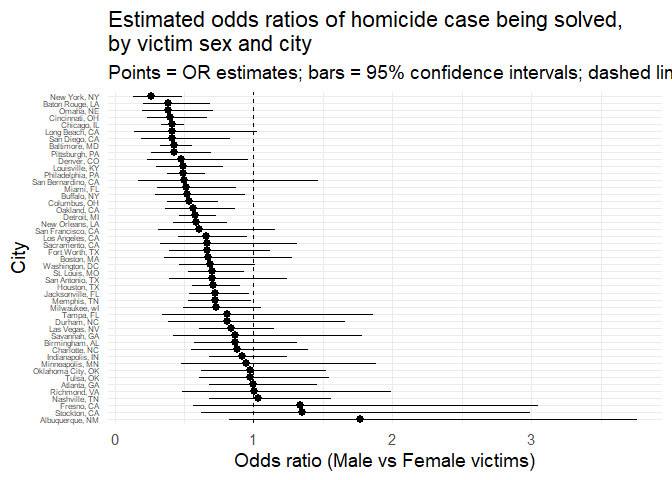
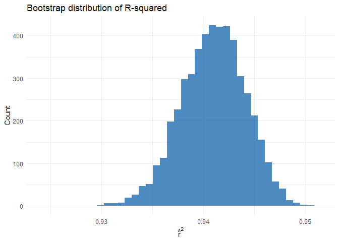

hw6
================
Kate
2025-12-03

## Problem 1

``` r
# Import homicide data from Washington Post GitHub
homicide_raw <- read_csv(
  "https://raw.githubusercontent.com/washingtonpost/data-homicides/master/homicide-data.csv"
)
```

    ## Rows: 52179 Columns: 12
    ## ── Column specification ────────────────────────────────────────────────────────
    ## Delimiter: ","
    ## chr (9): uid, victim_last, victim_first, victim_race, victim_age, victim_sex...
    ## dbl (3): reported_date, lat, lon
    ## 
    ## ℹ Use `spec()` to retrieve the full column specification for this data.
    ## ℹ Specify the column types or set `show_col_types = FALSE` to quiet this message.

``` r
# indicator identification and split data
homicide_clean <- homicide_raw %>%
  mutate(
    city_state = str_c(city, ", ", state),
    solved = disposition == "Closed by arrest"
  )%>%
  filter(
    !city_state %in% c("Dallas, TX", "Phoenix, AZ", 
                      "Kansas City, MO", "Tulsa, AL")
  ) %>%
  filter(victim_race %in% c("White", "Black")) %>%
  mutate(
    victim_age = as.numeric(victim_age),
    victim_sex = factor(victim_sex),
    victim_race = factor(victim_race)
  )
```

### Logistic Regression for one city

``` r
logistic_df <- homicide_clean %>%
  filter(city_state == "Baltimore, MD")

logistic_fit <- glm(
  solved ~ victim_age + victim_sex + victim_race,
  data = logistic_df,
  family = binomial()
)

logistic_OR <- logistic_fit %>%
  tidy(conf.int = TRUE, exponentiate = TRUE) %>%
  filter(term == "victim_sexMale") %>%
  select(term, estimate, conf.low, conf.high)

logistic_OR
```

    ## # A tibble: 1 × 4
    ##   term           estimate conf.low conf.high
    ##   <chr>             <dbl>    <dbl>     <dbl>
    ## 1 victim_sexMale    0.426    0.324     0.558

### Logistic Regression for Each City

``` r
city_ORs <- homicide_clean %>%
  group_by(city_state) %>%
  nest() %>%
  mutate(
    fit = map(
      data,
      ~ glm(solved ~ victim_age + victim_sex + victim_race,
            data = .x,
            family = binomial())
    ),
    tidied = map(
      fit,
      ~ tidy(.x, conf.int = TRUE, exponentiate = TRUE)
    )
  ) %>%
  unnest(tidied) %>%
  filter(term == "victim_sexMale") %>%
  select(city_state, estimate, conf.low, conf.high)
```

    ## Warning: There were 43 warnings in `mutate()`.
    ## The first warning was:
    ## ℹ In argument: `tidied = map(fit, ~tidy(.x, conf.int = TRUE, exponentiate =
    ##   TRUE))`.
    ## ℹ In group 1: `city_state = "Albuquerque, NM"`.
    ## Caused by warning:
    ## ! glm.fit: fitted probabilities numerically 0 or 1 occurred
    ## ℹ Run `dplyr::last_dplyr_warnings()` to see the 42 remaining warnings.

``` r
city_ORs
```

    ## # A tibble: 47 × 4
    ## # Groups:   city_state [47]
    ##    city_state      estimate conf.low conf.high
    ##    <chr>              <dbl>    <dbl>     <dbl>
    ##  1 Albuquerque, NM    1.77     0.825     3.76 
    ##  2 Atlanta, GA        1.00     0.680     1.46 
    ##  3 Baltimore, MD      0.426    0.324     0.558
    ##  4 Baton Rouge, LA    0.381    0.204     0.684
    ##  5 Birmingham, AL     0.870    0.571     1.31 
    ##  6 Boston, MA         0.674    0.353     1.28 
    ##  7 Buffalo, NY        0.521    0.288     0.936
    ##  8 Charlotte, NC      0.884    0.551     1.39 
    ##  9 Chicago, IL        0.410    0.336     0.501
    ## 10 Cincinnati, OH     0.400    0.231     0.667
    ## # ℹ 37 more rows

### plot for each city

``` r
city_ORs_plotdata <- city_ORs 

ggplot(city_ORs_plotdata,
aes(x = fct_reorder(city_state,estimate,.desc = TRUE), y = estimate,
ymin = conf.low, ymax = conf.high)) +
geom_pointrange() +
geom_hline(yintercept = 1, linetype = "dashed") +
coord_flip() +
labs(
x = "City",
y = "Odds ratio (Male vs Female victims)",
title = "Estimated odds ratios of homicide case being solved,\nby victim sex and city",
subtitle = "Points = OR estimates; bars = 95% confidence intervals; dashed line = OR = 1"
) +
theme(
    axis.text.y = element_text(size = 6)
)
```

<!-- -->
\####comment Most estimated odds ratios cluster around 1, and many
confidence intervals are wide and cross the reference line, suggesting
that in many cities there is no strong evidence of a difference in
clearance rates between male and female victims. A smaller subset of
cities shows ORs noticeably above 1, indicating higher odds of case
resolution for male victims, although again several of these estimates
have considerable uncertainty due to limited sample size.

### problem 2

``` r
data("weather_df")


# 1. Clean data


weather_clean <- weather_df %>%
  drop_na(tmax, tmin, prcp)  


# 2. Create 5000 bootstrap resamples


weather_bootstrap <- weather_clean %>%
  bootstrap(n = 5000, id = "bootstrap_id")


# 3. Fit models on each bootstrap sample


bootstrap_results <- weather_bootstrap %>%
  mutate(
    fit_model   = map(strap, ~ lm(tmax ~ tmin + prcp, data = .x)),
    model_glance = map(fit_model, glance),
    model_tidy   = map(fit_model, tidy)
  )


# 4. Extract R-squared values


bootstrap_r2 <- bootstrap_results %>%
  unnest(model_glance) %>%
  select(bootstrap_id, r.squared)


# 5. Extract coefficients and compute beta1/beta2 ratio


bootstrap_coef_ratio <- bootstrap_results %>%
  unnest(model_tidy) %>%
  filter(term %in% c("tmin", "prcp")) %>%
  select(bootstrap_id, term, estimate) %>%
  pivot_wider(names_from = term, values_from = estimate) %>%
  mutate(coef_ratio_tmin_prcp = tmin / prcp) %>%
  select(bootstrap_id, coef_ratio_tmin_prcp)


# 6. Merge the results


bootstrap_summary <- bootstrap_r2 %>%
  inner_join(bootstrap_coef_ratio, by = "bootstrap_id")

bootstrap_summary
```

    ## # A tibble: 5,000 × 3
    ##    bootstrap_id r.squared coef_ratio_tmin_prcp
    ##    <chr>            <dbl>                <dbl>
    ##  1 0001             0.941                -205.
    ##  2 0002             0.937                -229.
    ##  3 0003             0.945                -164.
    ##  4 0004             0.942                -167.
    ##  5 0005             0.943                -178.
    ##  6 0006             0.942                -159.
    ##  7 0007             0.939                -176.
    ##  8 0008             0.939                -227.
    ##  9 0009             0.938                -162.
    ## 10 0010             0.935                -201.
    ## # ℹ 4,990 more rows

``` r
# R-squared distribution
ggplot(bootstrap_summary, aes(x = r.squared)) +
  geom_histogram(bins = 40, fill = "#0057A8", alpha = 0.7) +
  labs(
    title = "Bootstrap distribution of R-squared",
    x = expression(hat(r)^2),
    y = "Count"
  ) +
  theme_minimal()
```

<!-- -->

``` r
# beta1 / beta2 distribution
ggplot(bootstrap_summary, aes(x = coef_ratio_tmin_prcp)) +
  geom_histogram(bins = 40, fill = "#E53935", alpha = 0.7) +
  labs(
    title = "Bootstrap distribution of beta1 / beta2",
    x = expression(hat(beta)[1] / hat(beta)[2]),
    y = "Count"
  ) +
  theme_minimal()
```

<!-- --> comments:
The bootstrap distribution of r squared shows that the model fits very
consistently well, with minimal sampling variability. Across the 5000
bootstrap samples, the model explains roughly 94.2% of the variance in
tmax, and this estimate remains extremely stable even when the model is
repeatedly refit on resampled datasets. The tight, symmetric
distribution indicates that the explanatory power of the model is highly
robust and does not depend strongly on any particular subset of
observations. In contrast, the bootstrap distribution of the coefficient
ratio 𝛽1/β2 is far less stable. The ratio is consistently negative,
reflecting that the two coefficients almost always have opposite signs,
but the distribution is noticeably wide and skewed. This suggests
substantial variability in the relative strength of the two predictors.
The large spread in the ratio is likely driven by the fact that β2(the
precipitation coefficient) can be small in magnitude in many bootstrap
samples, which produces instability when taking the ratio. Overall,
estimating the comparative influence of tmin and prcp is much less
stable than estimating the model’s overall goodness-of-fit.

``` r
# 95% bootstrap intervals
r2_ci <- bootstrap_summary %>%
  summarise(
    q2.5  = quantile(r.squared, 0.025),
    q97.5 = quantile(r.squared, 0.975)
  )

ratio_ci <- bootstrap_summary %>%
  summarise(
    q2.5  = quantile(coef_ratio_tmin_prcp, 0.025),
    q97.5 = quantile(coef_ratio_tmin_prcp, 0.975)
  )

r2_ci
```

    ## # A tibble: 1 × 2
    ##    q2.5 q97.5
    ##   <dbl> <dbl>
    ## 1 0.934 0.947

``` r
ratio_ci
```

    ## # A tibble: 1 × 2
    ##    q2.5 q97.5
    ##   <dbl> <dbl>
    ## 1 -275. -125.
